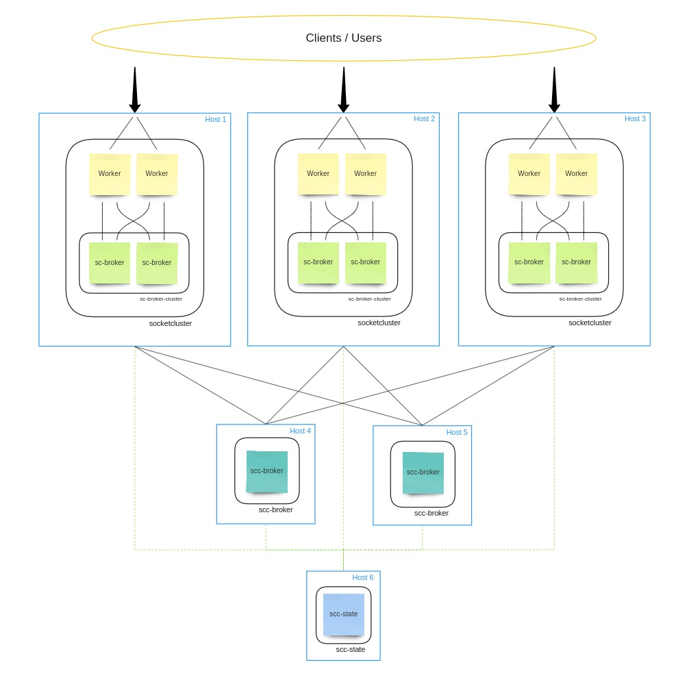

# SCC Guide

SCC is a collection of services which allow you to easily deploy and scale SocketCluster to any number of machines.
SCC is designed to scale linearly and is optimized for running on Kubernetes but it can be setup without using an orchestrator.

SCC is made up of the following services:

- socketcluster https://github.com/SocketCluster/socketcluster
- scc-broker https://github.com/SocketCluster/scc-broker
- scc-state https://github.com/SocketCluster/scc-state
- scc-ingress (Kubernetes only)

## How it works

The **socketcluster** service can be made up of any number of regular SocketCluster instances - The main difference between running **socketcluster** as a single instance vs running it as a cluster is
that in cluster mode, you need to point each **socketcluster** instance to a working `scc-state` (state server) instance.

The **scc-broker** service can be made up of any number of **scc-broker** instances - This is a special backend-only service which is designed to broker
messages between multiple frontend-facing **socketcluster** instances. All the pub/sub channels in your entire system will be sharded evenly across available **scc-broker** instances.
Just like with the **socketcluster** instances above, each **scc-broker** instance needs to point to a state server in order to work.

The **scc-state** service is made up of a single instance - Its job is to dispatch the state of the cluster to all interested services to allow them to reshard themselves. The **scc-state** instance will notify all frontend **socketcluster** instances whenever a new backend **scc-broker** joins the cluster. This allows **socketcluster** instances to rebalance their pub/sub channels evenly across available brokers whenever a new **scc-broker** instance joins the cluster.
Note that SCC can continue to operate without any disruption of service while the **scc-state** instance is down/unavailable so it is not a single point of failure in the classical sense (see notes at the bottom of this page).


An SCC setup across multiple hosts may look like this (though the quantity of each instance type is likely to vary; except for **scc-state** which only ever has one instance per cluster):



## Running on Kubernetes

Running on Kubernetes (K8s) is easy; you just need to run all the `.yaml` files from the `kubernetes/` directory from the SocketCluster repo (https://github.com/SocketCluster/socketcluster/tree/master/kubernetes) using the `kubectl` command (one at a time):

```
kubectl create -f <service-deployment-or-ingress-definition.yaml>
```

By default, you should also add a TLS/SSL key and cert pair to your provider (Rancher has a page were you can just paste them in).
Or if you don't want to use a certificate (not recommended), you can just delete these lines from `scc-ingress.yaml` before you create it with `kubectl`:

```
  tls:
  - secretName: scc-tls-credentials
```

Note that the step above is crucial if you don't want to use TLS/SSL - Otherwise the ingress load balancer service will not show up on your Rancher control panel until you add some credentials with the name `scc-tls-credentials` to your Rancher control panel (See Infrastructure &gt; Certificates page).

### Running on Kubernetes with Baasil (for simple development and deployment)

You can use the baasil CLI tool (https://www.npmjs.com/package/baasil) to deploy your SocketCluster service/app to any Rancher/Kubernetes environment, you just have to modify the `~/.kube/config` file on your local machine to hold the configs for your own Rancher control panel.
It ecommended that you use Kubernetes with Rancher for consistency. See http://rancher.com/ for more details.

To run your service/app locally inside containers and to deploy to your own Rancher/K8s cluster, follow this guide: https://docs.baasil.io/

## Running using Node.js directly

You can also run SCC using only Node.js version >= 6.x.x.
For simplicity, we will show you how to run everything on your localhost (`127.0.0.1`), but in practice, you will need to change `127.0.0.1` to an appropriate IP, host name or domain name.

First, you need to download each of these repositories to your machine(s):

- `git clone https://github.com/SocketCluster/scc-broker`
- `git clone https://github.com/SocketCluster/scc-state`

Then inside each repo, you should run `npm install` without any arguments to install dependencies.

Then you need to setup a new SocketCluster project to use as your user-facing instance. For info about how to setup a SocketCluster project, see this page: http://socketcluster.io/#!/docs/getting-started

Once you have the two repos mentioned earlier and your SocketCluster project setup, you should launch the state server first by
going inside your local **scc-state** repo and then running the command:

```
node server
```

Next, to launch a broker, you should navigate to your **scc-broker** repo and run the command:

```
SCC_STATE_SERVER_HOST='127.0.0.1' SOCKETCLUSTER_SERVER_PORT='8888' node server
```

Finally, to run a frontend-facing SocketCluster instance, you can navigate to your socketcluster project directory and run:

```
SCC_STATE_SERVER_HOST='127.0.0.1' SOCKETCLUSTER_PORT='8000' node server
```

You can add a second frontend-facing server by running (this time running on port 8001):

```
SCC_STATE_SERVER_HOST='127.0.0.1' SOCKETCLUSTER_PORT='8001' node server
```
Now if you navigate to either `localhost:8000` or `localhost:8001` in your browser, you should see that your pub/sub channels are shared between the two **socketcluster** instances.

Note that you can provide additional environment variables to various instances to set custom post numbers, passwords etc...
For more info, you can look inside the code in the `server.js` file in each repo and see what `process.env` vars are used.

When running multiples instances of any service on the same machine, make sure that the ports don't clash  - Modify the `SOCKETCLUSTER_SERVER_PORT` or `SOCKETCLUSTER_PORT` environment variable for each instance to make sure that they are unique.

## Notes

You should only ever run a single **scc-state** per cluster - This is currently a single point of 'failure', but not in the classical sense because the cluster can
continue to operate without any disruption while **scc-state** is unavailable. **scc-state** only needs to be available for a few seconds while SCC is
in the process of scaling itself up or down. Even if **scc-state** crashes while in the middle of scaling up or down, SCC will wait for **scc-state** to become available again (still without disruptions to the existing service) and will resume the scaling operation as soon as the **scc-state** instance becomes available again.
In the event of a crash, K8s will respawn **scc-state** within a few seconds so a failure of **scc-state** will only delay your scale up/down operation at worst.

Nevertheless, it is recommended that you run the **scc-state** instance inside your datacenter/AWS availability zone and do not expose it to the public internet.

The **scc-state** instance does not handle any pub/sub messages and so it is not a bottleneck with regards to the scalability of your cluster (SCC scales linearly).

Note that you can launch the services in any order you like but if your state server is not available, you may get harmless `Socket hung up` warnings on other instances (while they keep trying to reconnect) until **scc-state** becomes available again.

The **socketcluster** deployment in https://github.com/SocketCluster/socketcluster/kubernetes/ uses podAntiAffinity rule to ensure only one socketcluster instance is scheduled for any given kubernetes node. This may be preferred, since we want to run on as many cores as possible.
